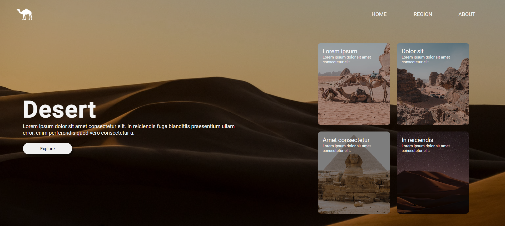

# Desert Themed Landing Page

This repository features a simple, fully responsive landing page with a desert theme, created using only HTML and CSS. The page highlights a minimalist design with desert-inspired visuals, making it suitable for showcasing websites or products with a nature or desert theme.



## Installation and usage

To view and run the landing page locally:

1. Clone the repository to your local machine:
   ```bash
   git clone https://github.com/belacartaxo/sahara-website.git

2. Open the index.html file in your preferred web browser to view the landing page.

## Features
- Responsive Design: The landing page adapts to various screen sizes, providing a smooth experience across devices.
- Desert Theme: The page includes desert-inspired visuals and colors for a unique and calming aesthetic.
- Pure HTML and CSS: No JavaScript or external frameworks were used, ensuring a lightweight and fast-loading page.

## Author
This repository is maintained by Your [Isabela Cartaxo](https://github.com/belacartaxo).
